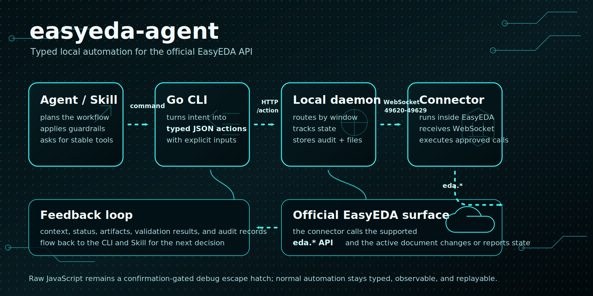

<p align="center">
  
</p>

<h1 align="center">easyeda-agent</h1>

<p align="center">
  AI-native automation layer for EasyEDA.
</p>

<p align="center">
  <a href="https://github.com/zhoushoujianwork/easyeda-agent"><b>GitHub</b></a> ·
  <b>Plugin marketplace</b> <em>(coming soon)</em> ·
  <a href="README.md">中文</a>
</p>



`easyeda-agent` turns the official EasyEDA extension API into a typed, observable, Skill-friendly system. The EasyEDA plugin stays thin: it connects to the local agent and executes approved actions. The Go CLI/daemon owns protocol, state, artifacts, validation, and user-facing workflows.

## Why This Exists

The upstream `run-api-gateway` proves the important entry point: code can run inside EasyEDA with access to the official `eda` object. Its rough edge is that it exposes raw JavaScript execution as the main workflow. That is powerful, but brittle for agents.

The connector is real and working: it port-scans `49620-49629`, validates a handshake, self-heals its connection, and dispatches a typed action catalog to the official `eda.*` API. Raw JS survives only as the confirmation-gated `debug.exec_js` escape hatch. See [docs/FEATURES.md](docs/FEATURES.md) for the full feature/roadmap inventory.

This project moves the system into a better shape:

- Skill describes expert workflow and guardrails.
- Go CLI/daemon exposes stable typed actions.
- EasyEDA connector plugin only bridges to official `eda.*` APIs.
- Artifacts, screenshots, DRC results, and audit logs are first-class outputs.

## How It Works

`easyeda-agent` keeps the automation surface narrow and observable:

- A Skill or human runs an `easyeda` command.
- The Go CLI validates inputs and submits a typed action to the local daemon.
- The daemon tracks connected EasyEDA windows, routes each action over WebSocket, and records audit logs, artifacts, and validation results.
- The connector extension runs inside EasyEDA and calls the official `eda.*` API.
- Structured results flow back to the CLI and Skill, so the next step can be planned from real editor state.

The action catalog now spans schematic, PCB, document navigation, board binding, artifacts, and diagnostics. The current inventory and roadmap live in [docs/FEATURES.md](docs/FEATURES.md).

## Standing on the Shoulders of Giants

We don't reinvent the wheel — we stack proven layers so an AI agent can use them directly:

- **Official `eda.*` API** — the 86 namespaces EasyEDA Pro exposes are the real capability substrate;
- **Upstream `run-api-gateway`** — proved the key entry point (code runs inside EasyEDA, reaching the `eda` object);
- **A mature AI-Agent Skill pattern** — a Skill describes the expert workflow + guardrails, and typed actions make every step **observable, verifiable, and replayable** instead of handing raw JS to the model.

On top of those three, easyeda-agent adds the engineering middle layer: a self-healing connector, a typed action catalog, real-bbox validation, a gated design flow, and the **flagship capability** below — the circuit-block library.

## Core Capabilities & Highlights

| Domain | What it does |
|---|---|
| 🧩 **Circuit-block library (flagship)** | Community-built, credited library of **proven peripheral subcircuits** (CH340 USB-serial, ESP32 auto-download, button de-bounce, USB-hub, buck…). **Copy the topology, only rebind boundary nets** to reuse |
| 📐 Schematic | Library-first placement (real LCSC/JLC parts), grouping, wiring, netflags, `sch check`/`layout-lint` real-bbox validation |
| 🔲 PCB | Auto-layout, board outline, keep-outs, rule-aware short-route, 4-layer power planes, copper pour, silkscreen avoidance, DRC/`pcb check` |
| 🔁 Design flow | Gated spine from a **customer-voice requirement** to a finished board (S0–S6 + P0–P10), milestone confirmation, save checkpoints |
| 📦 Artifacts | BOM (LCSC C-number enrichment), netlist, export, native screenshots, audit log, record→replay |

### 🧩 Highlight: the circuit-block library (contribute once, benefit forever)

**Fixed peripheral circuits can be copied verbatim.** The ESP32 auto-download circuit,
CH340 USB flashing, button de-bounce, USB-hub… their **internal topology is fixed** —
re-drawing them each time means re-walking the same pitfalls. The library distills them
into **validated, reusable blocks**: you only rebind the few boundary nets (ports) to the
host MCU, pins are referenced by **functional name** (so **zero pin-renumbering**), and
parts point back into the standard-parts library (BOM-ready).

- **Community-built + credited** — every block carries `author`/`contributors`; **contribute once, benefit forever**;
- **Validation gate** — a block only enters after passing `place → wire → check → DRC=0`, not "looks-right" prose;
- **Three dimensions** — parts (with alternatives) + schematic-wiring notes + PCB layout electrical constraints, all in one block;
- **AI-consumable** — the agent checks the library before hand-wiring a peripheral; on a hit it copies, skipping a whole module's selection + wiring.

> 📖 Library dir [`references/blocks/`](skills/easyeda-agent/references/blocks) (one block per file) ·
> browse with `blocks.py ls/show` · contribution guide
> [`standard-blocks-contributing.md`](skills/easyeda-agent/references/standard-blocks-contributing.md)

## Install Skills

> 📖 **Full setup & usage notes: [Quick Start →](docs/quick-start.md)** — the
> four-part suite (CLI / connector `.eext` / Skill / EasyEDA), version alignment,
> starting the daemon, upgrade discipline, and a troubleshooting table. **On
> upgrade, bump all three (CLI + connector + Skill) to the same version**, or
> `easyeda daemon health` flags the lagging connector as stale.

Install the `easyeda` CLI/daemon first, then import the EasyEDA connector URL printed
by the installer:

```bash
curl -fsSL https://raw.githubusercontent.com/zhoushoujianwork/easyeda-agent/main/install.sh | sh
```

The one-line script installs/updates the `easyeda` CLI/daemon, auto-detects
installed clients and installs/updates the `easyeda-agent` skill into each —
Codex (`~/.codex/skills/easyeda-agent`) and Claude Code
(`~/.claude/skills/easyeda-agent`) — and prints the connector `.eext` import URL.
Control skill install with env vars:

```bash
EASYEDA_INSTALL_SKILLS=codex,claude curl -fsSL .../install.sh | sh  # force targets
EASYEDA_INSTALL_SKILLS=none          curl -fsSL .../install.sh | sh  # skip skills
EASYEDA_SKILL_PRESERVE=1             curl -fsSL .../install.sh | sh  # keep local edits
```

The published skill slug is `easyeda-agent` (suffix intentional: it distinguishes this
community automation layer from official EasyEDA tooling). To install only the skill
from a registry:

```bash
# ClawHub (published automatically by `make release`, version matches the repo)
clawhub install easyeda-agent
```

> Note: skillhub.cn is currently a web-only community without a CLI install API
> (`/api/cli/v1` serves the web page, not an API), so `skillhub install
> --registry https://skillhub.cn` cannot work. Use the one-line installer above,
> or unpack `skills.tar.gz` from the GitHub Release into `~/.claude/skills/` or
> `~/.codex/skills/`.

The old split skills (`easyeda-schematic`, `easyeda-pcb`, `easyeda-design-flow`,
`easyeda-conventions`) have been merged and removed from the repository.

## Demo Example

A board driven end-to-end through the typed-action + Skill workflow — placed
**entirely from real LCSC / 立创 library parts** (search → place by uuid → wire →
flag → DRC), not hand-drawn symbols. Layout follows the
[auto-layout SOP](skills/easyeda-agent/references/auto-layout-sop.md) distilled
from a 嘉立创 reference design: **flags only on power/ground rails; signals are real
local orthogonal wires; decoupling hugs each IC's VCC pad; multi-page by function.**

This is also the project's fixed end-to-end regression case — driven from the raw
requirement in [esp32MiniRequire.md](esp32MiniRequire.md) (the agent does all the
engineering itself; no pre-solved BOM/netlist is handed to it).

### ESP32-S3-WROOM-1 minimal system board

The board below was produced by the agent driving the full PCB flow — **auto-place →
outline-fit → rule-aware route → 4-layer power planes → collision-aware silk** — then
verified on the real EasyEDA canvas (DRC 31 → 3 violations, No-Connection → 0):

<p align="center">
  
</p>

A few individual steps, each a real before/after on the same board:

| `pcb outline-fit` — tighten board to parts (17% → 71% utilization) | `pcb silk-align` — collision-aware designators |
|---|---|
|  →  |  → produces the aligned designators in the board above |

> A short screen-capture GIF of the end-to-end run will be added here (recording
> storyboard: [docs/demo-storyboard-esp32-mini.md](docs/demo-storyboard-esp32-mini.md)
> — schematic → import PCB → 4-layer stackup → placement → GND inner-plane / VCC signal
> plane → antenna keep-out + check → silkscreen/LED polarity → slot). The images above
> are real `pcb snapshot` captures from the fixed regression board, not mockups.

## Repository Layout

```text
cmd/easyeda/                 CLI entrypoint used by humans and Skills
internal/app/                CLI command implementation
internal/daemon/             Local daemon: /health, /eda (connector WS), /action
internal/protocol/           Typed action protocol shared with connector (actions.go)
internal/version/            Build/version metadata
extension/                   EasyEDA connector (.eext) source + build (TypeScript → esbuild)
skills/easyeda-agent/        Merged public Skill: workflow, references, scripts, canonical data
docs/                        Architecture, protocol, features/roadmap, conventions, decisions
```

## Current Commands

```bash
go run ./cmd/easyeda version
go run ./cmd/easyeda actions
go run ./cmd/easyeda daemon start
go run ./cmd/easyeda daemon health
go run ./cmd/easyeda doc ls --project <name>
go run ./cmd/easyeda sch drc --project <name>
go run ./cmd/easyeda pcb drc --project <name>
go run ./cmd/easyeda board list --project <name>
go run ./cmd/easyeda call system.health
```

`daemon start` starts the local server. It binds the first free port in `127.0.0.1:49620-49629` and serves three endpoints, then runs until interrupted (Ctrl-C / SIGTERM):

- `GET /health` — service identity, version, and connected windows
- `GET /eda` — WebSocket the EasyEDA connector registers on (daemon sends a `handshake` on connect)
- `POST /action` — a typed action envelope to forward to a connected window

`daemon health` scans the same port range for an `easyeda-agent` daemon. With the daemon running it reports `status: found` and lists connected windows; otherwise a clean `not_found` result is expected.

`call <action>` finds the running daemon and posts a typed action to it. `system.health` is answered by the daemon itself (no connector required); window-scoped actions need a connected EasyEDA window and return `NO_CONNECTOR` until the connector extension is running.

Both sides of the action protocol are in place and working. The Go daemon owns the protocol, state, artifacts, and validation; the EasyEDA connector under `extension/` is a buildable `.eext` that dispatches typed actions to live `eda.*` calls (type-checked against `@jlceda/pro-api-types`). See [extension/README.md](extension/README.md).

## Capabilities

What the agent can drive today, via typed CLI subcommands (`easyeda <domain> <verb>`). Each is a typed action → connector → live `eda.*` call, verified on the fixed ESP32-S3 regression board.

**Schematic**
- Place real library/LCSC parts by uuid, then wire them (`sch` place/wire); power/ground **net-flags** via `connect_pin` (auto-compensates the rotation-store quirk).
- **DRC** (`sch drc`) + reconstructed per-item **design check** (`sch check` — floating pins, wire-crossing, wire-over-pin) + geometric **layout-lint** (overlap/spacing).
- Module-aware **auto-layout** (place → verify → adjust), one-call **`sch read`** (components + nets + floating pins + check), **BOM**/**netlist** export (BOM LCSC-enriched).

**PCB — placement**
- **`pcb new-board`** — create a **brand-new board + empty PCB page** bound to a schematic (the CLI 新建PCB / schematic-to-PCB), then `pcb import-changes` to lay it out from scratch; distinct from link-only `board.create`.
- **`pcb auto-place`** — module-aware heuristic: satellites hug the chip pin they connect to, 2-pin parts re-oriented, multi-chip spread; **spacing is rule-aware** (derived from the live DRC clearance), with an `--assembly-gap` hand-solder floor.
- **`pcb outline-fit`** (tighten board to parts) / **`pcb outline-round`** (rounded-rect board outline).
- **`pcb layout-lint`** — placement quality + **routability score** (ratsnest MST + cross-net crossings) *before* routing; gate-able.
- **`pcb silk-align`** — **position-aware** designator placement (v2): ranks each label's 4 sides by local free space + board position + a crowd-axis bonus, and **avoids other parts' pads, bodies, keep-out regions, the outline, and other labels**; a boxed-in part is reported, never shoved onto a pad.
- **`pcb silk-add`** / **`pcb silk-set`** — add a **free silkscreen string** (board credit / LED `+`/`−` polarity marks, configurable layer/font/stroke/rotation, JLCPCB-legible defaults) + batch-adjust existing silk, incl. an **`--align --ref` shortcut** (center a board credit, align a label to a component/board/fill edge).
- **`pcb add-component`** — add one part to an existing PCB and net its pads (the working path around the broken incremental `import_changes`).

**PCB — routing & copper**
- **`pcb route-short`** — heuristic short-trace router: per-net MST, **rule-aware widths** (signal vs power), **obstacle-aware** L-orientation, **skips power/ground nets** (they belong in a pour).
- **`pcb pour`** (rule-aware copper-to-edge inset) / **`pcb pour-fit`** / **`pcb via-stitch`** / **`pcb rip-up`**.
- **`pcb power-planes`** — 4-layer power distribution: GND + power on **dedicated inner planes** + via-stitch each pad, then **flips the GND inner layer to 内电层/PLANE** after pouring (verified pour-while-SIGNAL → flip → rebuild recipe, DRC clean), matching the common customer stackup **GND=内电层 / VCC=signal layer** (drove the regression board's DRC 31→0, No-Connection to 0).
- **`pcb region`** (keep-out, incl. antenna no-copper) / **`pcb fill`** / **`pcb slot`** (挖槽 / board cutout on the MULTI layer).

**PCB — stackup, rules, fabrication**
- **`pcb stackup`** — set copper layer count (2/4/6…/32) + inner-layer type (signal↔plane/内电层).
- **Rule-aware everything** — the daemon reads the board's **live DRC rules** (`pcb drc-rules`) and conforms; falls back to a canonical **JLCPCB fab-rule reference** (real per-board-type exports). **`pcb drc`** runs the check.
- **`pcb export-dsn`** (Specctra DSN for external Freerouting, with keep-out injection) / **`pcb import-autoroute`** / **`pcb snapshot`**.

**Infrastructure**
- Typed action protocol (self-describing `--help`, `easyeda actions` catalog) with a `debug.exec_js` escape hatch for prototyping.
- **`easyeda notify`** — a non-blocking **in-window toast** (info/success/warn/error/question) so the flow can announce each stage live ("routing done, next: pour").
- Connector **auto-reconnect watchdog** (survives daemon restarts / window backgrounding) + daemon **debounced autosave**.

## Not Yet Supported / Platform Walls

Honest limits. A 2026-07-01 survey of the official marketplace ([`docs/marketplace-coverage.md`](docs/marketplace-coverage.md)) sharpened these — the real walls are only the *interactive UX* APIs; most "results" (tracks, vias, teardrops, net length) turn out to be reachable, and are on the absorb-list rather than blocked:

- **Maze-tier autorouting** (dense / any-distance / push-shove) — the daemon does *short, clear* heuristic routing only. Full routing is external **Freerouting** (the DSN round-trip building blocks exist); a turnkey integration is **deferred** (needs a Java runtime; waiting on the official EasyEDA autorouter maturing past `@alpha`).
- **Interactive routing UX** — the interactive *menu* (push-shove drag-routing, live length-tuning, remove-loops) has **no `eda.*` API**. But the *outputs* — diff-pair geometry, fanout-with-vias, serpentine length-match — are writable via `pcb_PrimitiveLine/Via.create`, so they're **feasible as our own heuristics** (absorb-list, not walled); only the drag UX is UI-only.
- **Controlled impedance Z0** — genuinely walled: stackup Er / dielectric height / copper weight aren't readable via `eda.*`, so trace-width-for-Z0 can't be computed. **But net length IS readable** (`pcb_Net.getNetLength`), so length-match / skew / timing-margin reports are doable (absorb-list) — that part was mis-flagged as a wall.
- **Teardrops (泪滴)** — no *typed* create API; a raw document-source-injection path (as `eext-balance-copper` uses for net-less fills) is plausible but unverified. For now, apply by hand in the UI.
- **No programmatic undo** — `eda.*` has no undo/redo; rollback is our own (data checkpoint + inverse ops).
- **Incremental `import_changes`** — a no-op for API-added parts (platform limit); place the whole circuit before the first import, or use `pcb add-component`.
- **Silkscreen density** — `silk-align` avoids label collisions where there's open space; a layout packed tighter than the labels can't be fully de-conflicted (it reports `unresolvedCollisions`) — loosen the placement.

See [`docs/marketplace-coverage.md`](docs/marketplace-coverage.md) for the full marketplace coverage matrix + prioritized absorb-list, [`docs/FEATURES.md`](docs/FEATURES.md) for the action inventory, and [`docs/ecosystem-survey.md`](docs/ecosystem-survey.md) for the `eda.*` API coverage map.

## Design Position

Raw JavaScript execution remains useful for debugging, but not as the primary AI surface. The default surface should be typed actions with explicit inputs, predictable outputs, artifact handling, and verification hooks.

See:

- [Feature inventory and roadmap](docs/FEATURES.md)
- [Architecture](docs/architecture.md)
- [Protocol](docs/protocol.md)
- [Skill design](docs/skill-design.md)
- [Historical Phase 1 schematic scope](docs/phase-1-schematic.md)
- [Historical Phase 2 PCB feasibility](docs/phase-2-pcb.md)

## Acknowledgments

Huge thanks to **嘉立创EDA / EasyEDA Pro (JLCPCB)** for opening up the extension
plugin channel and the official `eda.*` API. This entire automation layer is built
**on top of that open plugin platform** — it simply would not exist without it.
`easyeda-agent` stays a thin, well-behaved community citizen of the official plugin
system, and every capability here ultimately dispatches to JLC's own `eda.*` calls.
感谢嘉立创开放的 EDA 插件通道,让我们能做出这样一个好用的自动化插件。 🙏

### Referenced projects & prior art

Built on / inspired by these open projects — thank you:

- [**@jlceda/pro-api-types**](https://www.npmjs.com/package/@jlceda/pro-api-types) — official EasyEDA Pro `eda.*` API type definitions (the connector is type-checked against it).
- [**Freerouting**](https://github.com/freerouting/freerouting) — the external maze-tier autorouter our `pcb export-dsn` / `import-autoroute` round-trip targets.
- [**spf13/cobra**](https://github.com/spf13/cobra) (CLI framework) · [**coder/websocket**](https://github.com/coder/websocket) (daemon ↔ connector) · [**esbuild**](https://github.com/evanw/esbuild) (connector bundling).
- **Official EasyEDA extensions** ([github.com/easyeda](https://github.com/easyeda)) — we study their `eda.*` API usage + algorithms (not their UI) as prior art; the absorb-list lives in [`docs/ecosystem-survey.md`](docs/ecosystem-survey.md). Notably [`eext-run-api-gateway`](https://github.com/easyeda/eext-run-api-gateway) proved the in-editor code channel, and [`eext-export-design-report`](https://github.com/easyeda/eext-export-design-report) informed our design-report reads.
- Candidate not yet absorbed: [**polyclip-ts**](https://github.com/luizbarboza/polyclip-ts) (polygon boolean) — for a future silkscreen-fill-with-obstacle-avoidance (`docs/ecosystem-survey.md` A10).

## Star History

Thanks for every star — we're at 39 ⭐ 🎉

[](https://www.star-history.com/#zhoushoujianwork/easyeda-agent&Date)
