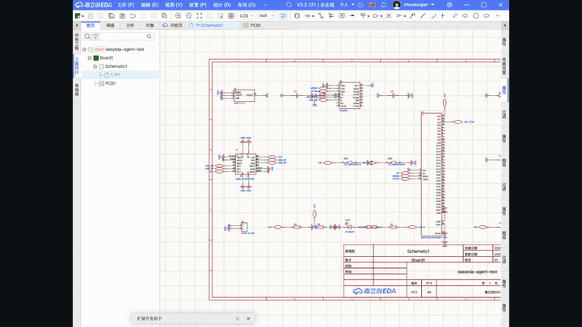
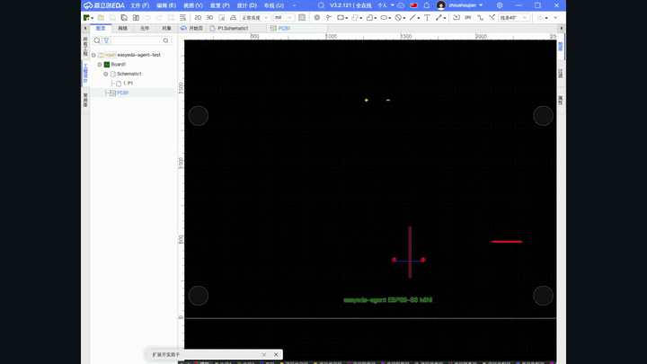

<p align="center">
  
</p>

<h1 align="center">easyeda-agent</h1>

<p align="center">
  面向 EasyEDA(嘉立创EDA专业版)的 AI 原生自动化层
</p>

<p align="center">
  <a href="https://github.com/zhoushoujianwork/easyeda-agent"><b>GitHub</b></a> ·
  <b>插件市场</b> <em>(即将上架)</em> ·
  <a href="README.en.md">English</a>
</p>


`easyeda-agent` 把官方 EasyEDA 扩展 API 变成一套**有类型、可观测、Skill 友好**的系统。EasyEDA 插件保持极薄——它连到本地 agent、只执行被批准的动作;Go CLI/daemon 掌管协议、状态、产物、校验和面向用户的工作流。

## 为什么做这个

上游 `run-api-gateway` 证明了关键入口:代码能跑在 EasyEDA 内、访问官方 `eda` 对象。但它把「裸 JavaScript 执行」当作主工作流——强大,但对 AI agent 太脆弱。

本项目的连接器是真实可用的:端口扫描 `49620-49629`、校验握手、**自愈重连**、把一套**有类型的动作目录**分发到官方 `eda.*` API。裸 JS 仅作为需二次确认的 `debug.exec_js` 逃生口保留。

- **Skill** 描述专家工作流和护栏;
- **Go CLI/daemon** 暴露稳定的 typed actions;
- **EasyEDA 连接器插件** 只做到官方 `eda.*` 的桥接;
- 产物、截图、DRC 结果、审计日志都是一等输出。

## 工作原理

- Skill 或人跑一条 `easyeda` 命令;
- Go CLI 校验输入、把 typed action 提交给本地 daemon;
- daemon 跟踪已连接的 EasyEDA 窗口、经 WebSocket 路由每个动作、记录审计日志/产物/校验结果;
- 连接器扩展跑在 EasyEDA 内、调用官方 `eda.*` API;
- 结构化结果回流到 CLI 和 Skill,下一步基于**真实编辑器状态**来规划。

动作目录已覆盖原理图、PCB、文档导航、板级绑定、产物导出、诊断。完整清单与路线图见 [docs/FEATURES.md](docs/FEATURES.md)。

## 安装

先装 `easyeda` CLI/daemon,再按安装器打印的地址导入 EasyEDA 连接器:

```bash
curl -fsSL https://raw.githubusercontent.com/zhoushoujianwork/easyeda-agent/main/install.sh | sh
```

一键脚本会：安装/更新 `easyeda` CLI/daemon;自动检测已安装的客户端并把 `easyeda-agent` skill 安装/更新到对应目录 —— Codex(`~/.codex/skills/easyeda-agent`)、Claude Code(`~/.claude/skills/easyeda-agent`);打印连接器 `.eext` 导入地址。可用环境变量控制 skill 安装:

```bash
EASYEDA_INSTALL_SKILLS=codex,claude curl -fsSL .../install.sh | sh  # 指定目标
EASYEDA_INSTALL_SKILLS=none          curl -fsSL .../install.sh | sh  # 跳过 skill
EASYEDA_SKILL_PRESERVE=1             curl -fsSL .../install.sh | sh  # 保留本地改动
```

Skill slug 为 `easyeda-agent`(后缀有意为之,区分于官方 EasyEDA 工具)。只从 registry 装 skill:

```bash
# ClawHub(make release 时自动同步发布,版本与 repo 对齐)
clawhub install easyeda-agent
```

> 国内用户注意:skillhub.cn 目前是纯网页社区,未实现 CLI 安装接口
> (`/api/cli/v1` 返回的是网页而非 API),`skillhub install --registry
> https://skillhub.cn` 无法工作。请改用上面的一键脚本,或从 GitHub Release
> 下载 `skills.tar.gz` 解压到 `~/.claude/skills/` 或 `~/.codex/skills/`。

> EasyEDA 需开启「**允许外部交互**」,连接器的 WebSocket 才能连到本地 daemon。

## 效果演示

> 📖 **完整实战案例:[一份需求文档 → AI 全自动画完 ESP32-S3 四层板](docs/showcase-esp32-mini.md)** ——
> 19 器件原理图 + 四层 PCB(GND 内电层/VCC 电源层/天线禁铜/四角 M3),
> `pcb drc` Connection/Clearance 双归零、`pcb check` 0、`layout-lint` 100/100,附原生截图与全流程复盘。

下面两段录屏来自真实 EasyEDA 画布:AI 从空白页开始生成原理图,再切到 PCB 完成布局、板框、铺铜和丝印。它不是生成一张电路图图片,而是在编辑器里一步步执行 typed actions:

| 原理图从空白页生成 | PCB 布局与铺铜 |
|---|---|
|  |  |

下面这块板由 agent 驱动完整 PCB 流程产出——**自动布局 → 板框贴合 → 规则感知布线 → 4 层电源平面 → 丝印碰撞避让**——并在真实 EasyEDA 画布上验证(DRC 31 → 3、No-Connection 归零):

<p align="center">
  
</p>

几个单步的真机前后对比(同一块板):

| `pcb outline-fit` 板框贴合(利用率 17% → 71%) | `pcb silk-align` 丝印碰撞避让 |
|---|---|
|  →  |  → 对齐后见上方成品板 |

> 上面 GIF 和截图都来自回归板真机流程(原理图 → 导入 PCB → 4 层叠层 → 布局 → GND 内电层/VCC 信号 plane → 天线禁区+检查 → 丝印/LED 极性 → 挖槽),非 mockup。这也是项目的固定端到端回归用例(拿原始需求从零跑),见 [esp32MiniRequire.md](esp32MiniRequire.md)。

## 能力清单(已支持)

均以 typed CLI 子命令暴露(`easyeda <domain> <verb>`),每项都在固定的 ESP32-S3 回归板上真机验证过。

**原理图**
- 从立创/LCSC 库按 uuid 放**真实器件**再布线;电源/地**网络标志**用 `connect_pin`(自动补偿旋转存储的坑)。
- **DRC**(`sch drc`)+ 重建的逐项**设计检查**(`sch check`——悬空引脚、导线交叉、导线压引脚)+ 几何 **layout-lint**(重叠/间距)。
- 模块感知**自动布局**(放置→校验→调整)、一次调用 **`sch read`**(器件+网络+悬空引脚+检查)、**BOM**/**网表**导出(BOM 自动补 LCSC C 号)。

**PCB — 布局**
- **`pcb new-board`** — 从原理图**新建一块板 + 空 PCB 页**并绑定(CLI 版「新建 PCB / 原理图转 PCB」),再 `pcb import-changes` 从零布局;区别于只做链接的 `board.create`。
- **`pcb auto-place`** — 模块感知启发式:卫星器件贴到它所连芯片引脚那侧,2 脚器件自动转向,多芯片铺开;**间距规则感知**(由 live DRC clearance 推导),`--assembly-gap` 兜底手焊间距。
- **`pcb outline-fit`**(板框贴合器件)/ **`pcb outline-round`**(圆角矩形板框)。
- **`pcb layout-lint`** — 布局质量 + **可布性评分**(飞线 MST + 跨网交叉),布线前预测。
- **`pcb silk-align`** — 位号**位置感知**避让重排(v2):按局部空隙 + 板上位置 + 拥挤轴给每个位号的 4 个方向打分,**避开别人的焊盘/器件体/禁区/板框/其它标签**;挤死的报告出来而非压到焊盘上。
- **`pcb silk-add`** / **`pcb silk-set`** — 加**自由丝印字串**(板注 / LED 极性 `+`/`−` 标记,可配层/字号/线宽/旋转,JLCPCB 可读默认)+ 批量调整已有丝印,含 **`--align --ref` 对齐参考**(板注居中到板框、标签对齐器件边)。
- **`pcb add-component`** — 往已有 PCB 加单个器件并连接其焊盘网络(绕过失效的增量 `import_changes`)。

**PCB — 布线与铜**
- **`pcb route-short`** — 启发式短线布线:每网 MST、**规则感知线宽**(信号 vs 电源)、**障碍感知** L 朝向、**默认跳电源/地网**(它们该铺铜)。
- **`pcb pour`**(规则感知铜到板边内缩)/ **`pcb pour-fit`** / **`pcb via-stitch`** / **`pcb rip-up`**。
- **`pcb power-planes`** — 4 层电源分配:GND + 电源各占**专用内平面** + 每焊盘过孔缝合,铺铜后把 **GND 内层翻成 内电层/PLANE**(信号层铺铜→翻类型→重灌的验证配方,DRC 干净),匹配常见客户叠层 **GND=内电层 / VCC=信号层**(把回归板 DRC 31→0、No-Connection 归零)。
- **`pcb region`**(禁铺铜/天线净空)/ **`pcb fill`** / **`pcb slot`**(挖槽 / MULTI 层板挖空)。

**PCB — 叠层、规则、制造**
- **`pcb stackup`** — 设铜层数(2/4/6…/32)+ 内层类型(信号↔平面/内电层)。
- **全链路规则感知** — daemon 读板子 **live DRC 规则**(`pcb drc-rules`)并遵循;缺失时回退到权威 **JLCPCB fab 规则参考**(真实分板型导出)。**`pcb drc`** 跑检查。
- **`pcb export-dsn`**(Specctra DSN,给外部 Freerouting,带禁布区注入)/ **`pcb import-autoroute`** / **`pcb snapshot`**。

**基础设施**
- Typed action 协议(`--help` 自描述、`easyeda actions` 目录)+ `debug.exec_js` 原型逃生口。
- **`easyeda notify`** — 在 EasyEDA 窗口内弹**非阻塞 toast**(info/success/warn/error/question),流程可实时播报每一步(「完成布线,下一步铺铜」)。
- 连接器**自愈重连看门狗**(daemon 重启/窗口后台都能自动回来)+ daemon **防抖自动保存**。

## 暂不支持 / 平台墙

诚实说明边界。2026-07-01 对官方市场的扫描([docs/marketplace-coverage.md](docs/marketplace-coverage.md))校正了这些——真正的墙只在**交互式 UX** API,大多数「结果」(走线/过孔/泪滴/网长)其实够得到,进了吸收清单而非被堵死:

- **迷宫档自动布线**(密集/任意距离/推挤)—— daemon 只做*短、清晰*的启发式布线。完整布线走外部 **Freerouting**(DSN 往返构件已就绪);turnkey 集成**暂缓**(需 Java;等官方自动布线器过 `@alpha`)。
- **交互式布线 UX** —— 交互*菜单*(推挤拖拽布线、实时等长绕蛇、去环)**无 `eda.*` API**。但它们的*输出*——差分对几何、扇出打孔、等长绕线——可用 `pcb_PrimitiveLine/Via.create` 写出,所以**可作为我们的启发式实现**(吸收清单,非墙);只有拖拽 UX 是 UI 专属。
- **受控阻抗 Z0** —— 真的墙:叠层 Er / 介质厚 / 铜厚 `eda.*` 读不到,算不了 Z0 线宽。**但网长能读**(`pcb_Net.getNetLength`),所以等长/skew/时序余量报告可做(吸收清单)——这块之前被我误标成墙。
- **泪滴(teardrop)** —— 无*typed* create API;但文档源注入路径(如 `eext-balance-copper` 做 net-less 填充那样)可能可行,未验证。暂时 UI 里手动应用。
- **无编程 undo** —— `eda.*` 没有 undo/redo;回滚靠自建(数据快照 + 反向操作)。
- **增量 `import_changes`** —— 对 API 新增器件是 no-op(平台限制);首次同步前放完整电路,或用 `pcb add-component`。
- **丝印密度极限** —— `silk-align` 在有空白处避让标签;比标签更密的布局无法完全消重(报 `unresolvedCollisions`)——请放松布局。

市场覆盖矩阵 + 优先吸收清单见 [docs/marketplace-coverage.md](docs/marketplace-coverage.md);动作清单见 [docs/FEATURES.md](docs/FEATURES.md);`eda.*` API 覆盖地图见 [docs/ecosystem-survey.md](docs/ecosystem-survey.md)。

## 仓库结构

```text
cmd/easyeda/                 CLI 入口(人和 Skill 都用)
internal/app/                CLI 命令实现
internal/daemon/             本地 daemon:/health、/eda(连接器 WS)、/action
internal/protocol/           与连接器共享的 typed action 协议(actions.go)
extension/                   EasyEDA 连接器(.eext)源码 + 构建(TypeScript → esbuild)
skills/easyeda-agent/        合并后的公开 Skill:工作流、参考、脚本、规范数据
docs/                        架构、协议、功能/路线图、规范、决策
```

## 设计定位

裸 JavaScript 执行对调试仍有用,但不作为主要的 AI 界面。默认界面应该是**有类型的动作**:明确输入、可预测输出、产物处理、校验钩子。

延伸阅读:[功能清单与路线图](docs/FEATURES.md) · [架构](docs/architecture.md) · [协议](docs/protocol.md) · [Skill 设计](docs/skill-design.md) · [开发环境与调试手册](docs/dev-environment.md)

## 致谢

特别感谢 **嘉立创EDA(EasyEDA 专业版 / 嘉立创)** 开放的**扩展插件通道**和官方 `eda.*`
API。整个自动化层都建立在这个开放的插件平台之上——没有它,就没有这个项目。
`easyeda-agent` 始终做官方插件体系里一个薄而规矩的「公民」,这里的每一项能力最终都
落到嘉立创自己的 `eda.*` 调用上。感谢嘉立创让我们能做出这样一个好用的插件。 🙏

### 引用项目与前置工作(鸣谢)

站在这些开源项目的肩膀上——感谢:

- [**@jlceda/pro-api-types**](https://www.npmjs.com/package/@jlceda/pro-api-types) —— 官方 EasyEDA Pro `eda.*` API 类型定义(连接器对它做类型校验)。
- [**Freerouting**](https://github.com/freerouting/freerouting) —— 外部迷宫档自动布线器,我们的 `pcb export-dsn` / `import-autoroute` 往返对接它。
- [**spf13/cobra**](https://github.com/spf13/cobra)(CLI 框架)· [**coder/websocket**](https://github.com/coder/websocket)(daemon ↔ 连接器)· [**esbuild**](https://github.com/evanw/esbuild)(连接器打包)。
- **官方 EasyEDA 扩展**([github.com/easyeda](https://github.com/easyeda))—— 我们研究它们的 `eda.*` API 用法与算法(不抄 UI)作为前置工作;吸收清单见 [`docs/ecosystem-survey.md`](docs/ecosystem-survey.md)。其中 [`eext-run-api-gateway`](https://github.com/easyeda/eext-run-api-gateway) 证明了编辑器内代码通道,[`eext-export-design-report`](https://github.com/easyeda/eext-export-design-report) 启发了设计报告读取。
- 尚未吸收的候选:[**polyclip-ts**](https://github.com/luizbarboza/polyclip-ts)(多边形布尔)—— 用于未来的丝印填充避让(见 `docs/ecosystem-survey.md` A10)。

## Star History

感谢每一颗 star —— 我们刚过 30 ⭐ 🎉

[](https://star-history.com/#zhoushoujianwork/easyeda-agent&Date)
