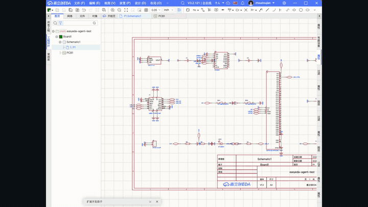

# EasyEDA Agent Connector

面向 EasyEDA（嘉立创EDA专业版）的 AI 原生自动化连接器。

`easyeda-agent` 把官方 EasyEDA 扩展 API 变成一套**有类型、可观测、Skill 友好**的系统。这个连接器插件本身保持很薄：它只负责连接本地 `easyeda-agent` daemon，并把 typed actions 分发到官方 `eda.*` API；真正的工作流、校验、确认、产物处理和多步编排，都在 Go CLI/daemon 与 Skill 层完成。

```text
Skill / CLI -> Go daemon -> EasyEDA Agent Connector -> official eda.* API
```

- GitHub 仓库：https://github.com/zhoushoujianwork/easyeda-agent
- 安装脚本：https://raw.githubusercontent.com/zhoushoujianwork/easyeda-agent/main/install.sh

## 效果演示

下面两段录屏来自真实 EasyEDA 画布：AI 从空白页开始生成原理图，再切到 PCB 完成布局、板框、铺铜和丝印。它不是生成一张图片，而是在编辑器里一步步执行 typed actions。

**原理图从空白页生成：**



**PCB 布局与铺铜：**


下面这块板由 agent 驱动完整 PCB 流程产出：**自动布局 -> 板框贴合 -> 规则感知布线 -> 4 层电源平面 -> 丝印碰撞避让**，并在真实 EasyEDA 画布上验证。


## 它是什么

这是一个真实可打包、可导入的 **EasyEDA Pro 扩展**。它桥接本地 `easyeda-agent` Go daemon 与官方 `eda.*` API，并且是整个系统中**唯一直接调用 `eda.*` 的组件**。

它主要负责：

- 本地 WebSocket 传输：端口扫描、握手、注册、上下文同步、心跳、自愈重连。
- typed action 分发：把 daemon 下发的结构化动作映射到官方 `eda.*` 调用。
- 结果序列化：把执行结果、警告、错误、上下文回传给 daemon。
- 产物传输：把截图、BOM、网表等二进制结果编码后回传。

## 已支持的典型能力

- 原理图：放真实器件、布线、网络标志、选择、截图、DRC、BOM 导出、网表导出。
- PCB：新建板、导入、自动布局、板框贴合、铺铜、禁布区、叠层设置、截图、DSN 往返。
- 基础设施：自动重连、上下文感知、结构化错误、`debug.exec_js` 逃生口。

完整能力清单见 GitHub 仓库中的 `docs/FEATURES.md`。

## 安装

先安装 `easyeda` CLI/daemon，再导入这个连接器：

```bash
curl -fsSL https://raw.githubusercontent.com/zhoushoujianwork/easyeda-agent/main/install.sh | sh
```

安装后请在 EasyEDA 中确认：

1. 已导入 `.eext` 连接器。
2. 已开启「允许外部交互 / Allow external interaction」。
3. 已启动本地 `easyeda-agent` daemon。

## 重新打包

```bash
make eext
```

这会 bump patch 版本、执行 typecheck，并生成新的 `.eext` 包。

## 说明

这个 README 是面向插件导入页/插件包展示的精简版说明。更完整的架构、路线图、能力矩阵与实战案例，请直接查看 GitHub 仓库：

https://github.com/zhoushoujianwork/easyeda-agent
